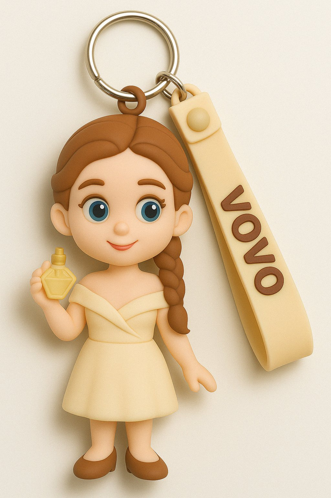
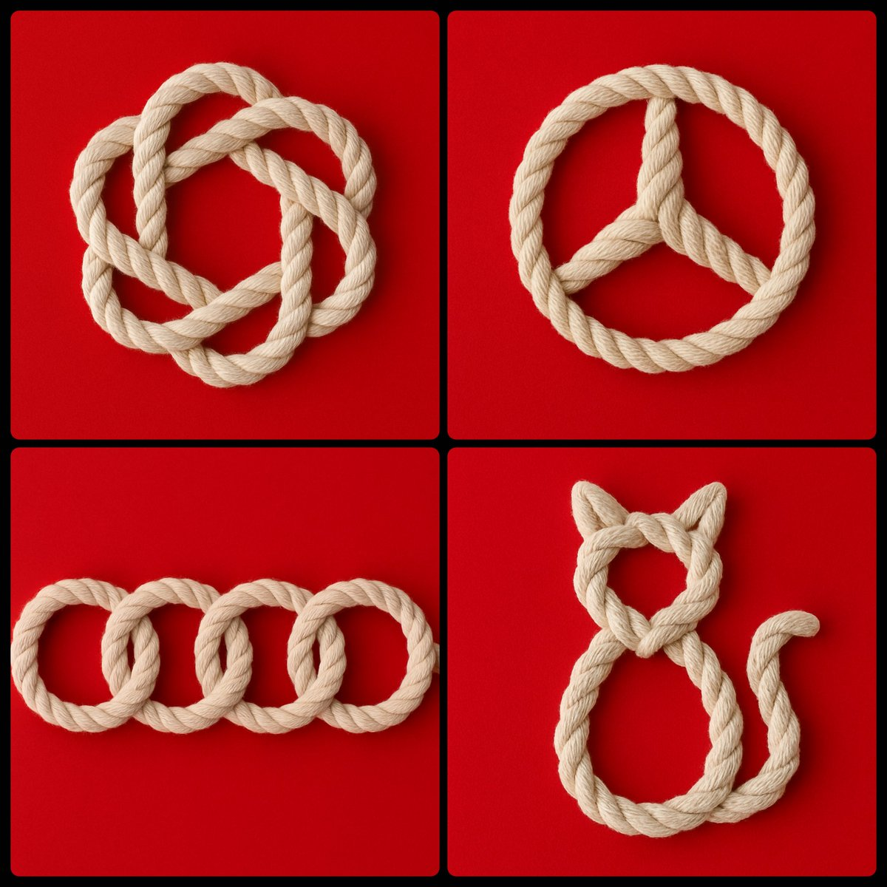
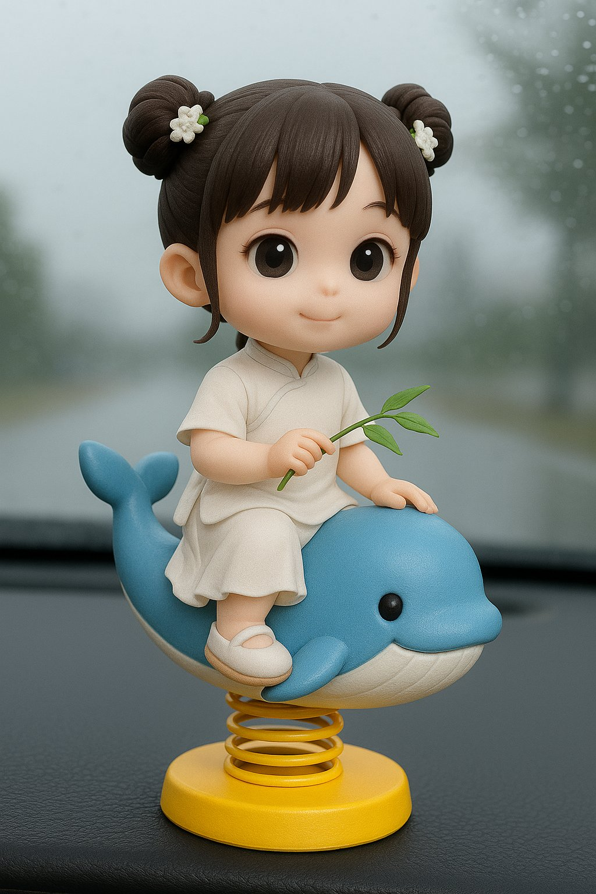
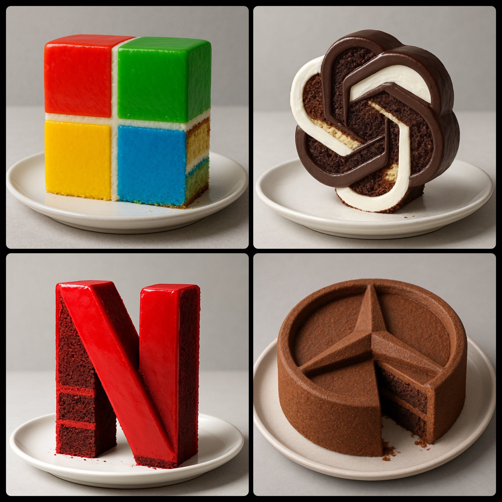
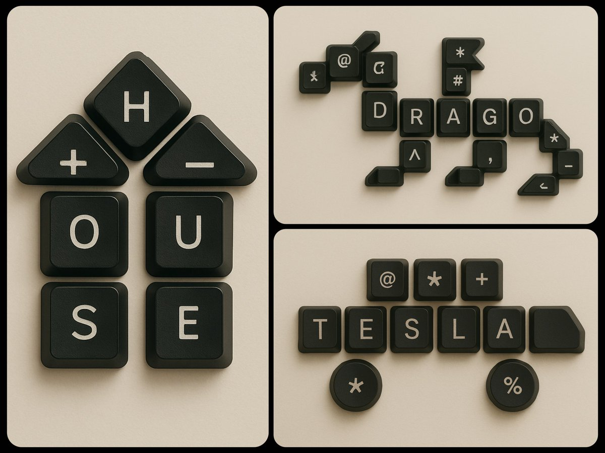
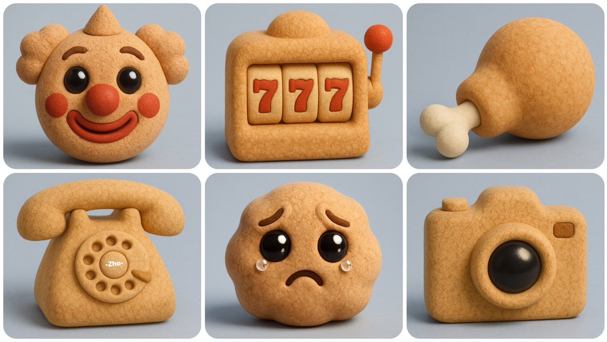
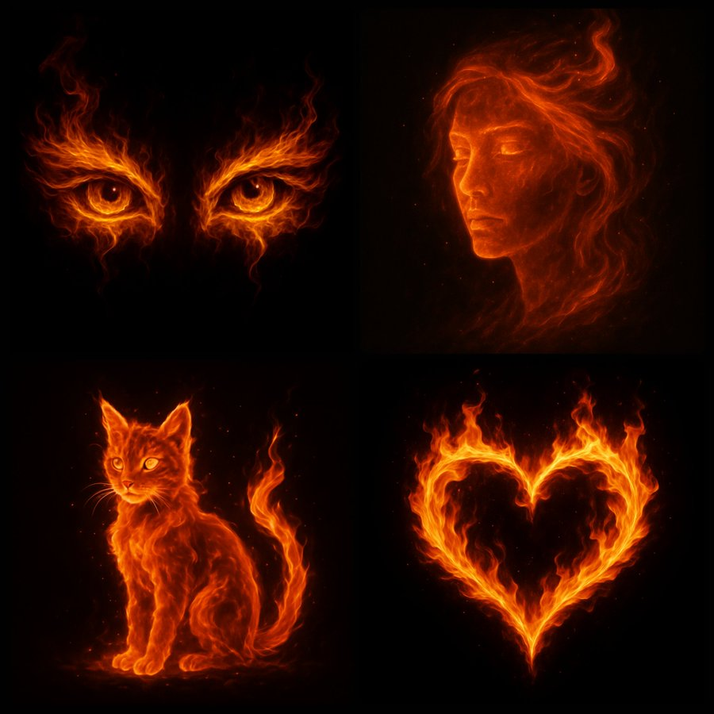

# gpt-4o-prompts

Prompts for ChatGPT-4o to create amazing visuals!

## cute  keychain

Prompt:

~~~
Create a cute 3D cartoon keychain version of the person in the uploaded photo. Transform the face and pose into a soft, simplified toy-like figure with a silicone-like smooth texture and pastel colors. Add a name tag that says "[NAME]" attached to the keychain in a playful rounded font. No background, minimal shadows. Toy product design for keychain format.
~~~

> from: https://x.com/miilesus/status/1916854977873535069

## viral meme

Prompt:

~~~
Create image. Create a toy of the person in the photo. Let it be an action figure. Next to the figure, there should be the toy’s equipment, each in its individual blisters. 1) a book called “Tecnoforma”. 2) A 3-headed dog with a tag that says “Troika” and a bone at its feet with word “austerity” written on it. 3) a three-headed Hydra with with a tag called “Geringonça”. 4) a book titled “D. Sebastião”. Don’t repeat the equipment under any circumstance. The card holding the blister should be strong orange. Also, on top of the box, write ‘Pedro Passos Coelho’ and underneath it, ‘PSD action figure’. The figure and equipment must all be inside blisters. Visualize this in a realistic way.
~~~

> from: https://x.com/patife/status/1907781179316781536

## Rope art

Prompt:
~~~
photograph of a [SUBJECT]-shaped knot crafted from thick white rope. The rope is intricately woven into the silhouette of a [SUBJECT]. The knot is set against a solid red background, with soft, even lighting that highlights the rope’s texture and the craftsmanship of the design
~~~

> from: https://x.com/umesh_ai/status/1917176581254222216

## cute car items art

prompt：

~~~
将附件人物转换成3D Q版汽车摆件，带黄色弹簧底座,萌娃坐在一只【蓝色青蛙】上，背景是汽车挡风玻璃
~~~

> from: https://x.com/balconychy/status/1916763235623063802

## Cake Logos

prompt:
~~~
Create a hyper-realistic photograph of a cake designed in the shape of the [LOGO NAME] logo. The cake should maintain the recognizable structure and design elements of the logo, but with a realistic, edible cake texture. The interior should feature [CAKE FLAVORS] layers, clearly visible through a sliced or slightly crumbed edge. The exterior should be coated with [FROSTING/COLOR SCHEME] to match the logo’s colors and style, with slight imperfections showing it is a real cake. Display the cake on a [PLATE/BASE STYLE] against a [BACKGROUND STYLE], with soft natural lighting emphasizing the rich textures and delicious details
~~~

> from: https://x.com/umesh_ai/status/1916739072007274863

## keyboard keycaps art

prompt:

~~~
Create a digital artwork featuring an arrangement of black keyboard keycaps forming the shape of a [OBJECT]. Use keycaps with white letters and some additional symbols (like @, #, *, %, +) to complete the design. Place the [OBJECT] on a smooth, off-white textured background, with soft, diffused lighting to highlight the keys' surfaces and create gentle shadows. The shape should be easily recognizable and arranged either in portrait or landscape mode depending on the [OBJECT]'s natural orientation
~~~

> from: https://x.com/umesh_ai/status/1916359637722452403

## 3D softwood art

prompt:

~~~
创建 [ 🥹 ] 的高分辨率 3D 渲染图，将其设计为一个可爱的软木材质的3d模型。其形状应看起来柔软、圆润和蓬松。其形状应略微不规则且柔软，并配以柔和的阴影和灯光，以突出其体积感和真实感。将其放置在干净简约的背景（浅灰色或淡蓝色）上，并保持俏皮的雕塑美
~~~

> from: https://x.com/ZHO_ZHO_ZHO/status/1914330931906609600

## flames artwork 

Prompt:

~~~
A digital artwork of [SUBJECT] composed entirely of flames, set against a black background
~~~

## Teacher

Prompt:
~~~
生成一张 穿紧身 OL 的女讲师在黑板前讲课的照片，整体只需要黑板和女老师就行，女老师年纪25岁左右，戴眼镜，身材性感，长相符合亚洲审美，需要写实风格，参考日本电影，黑板上写着 “解决问题，从别人的利益出发，从人的劣根性出发，问题秒解，一但脱离这个原则，你的行为可能全错。 ​​​"
~~~

> from: https://x.com/shizhiang1/status/1917131279566573828